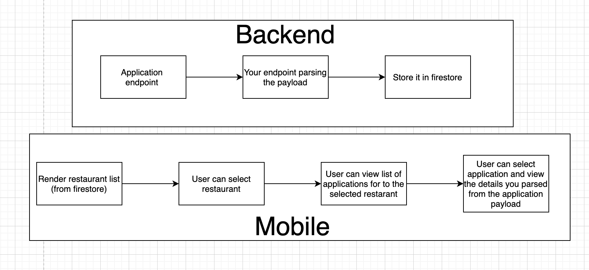

# wANNA join? (the code challenge)

## Table of Contents

1. [What are we gonna build?](#what-are-we-gonna-build)
   1. [Backend](#backend)
   2. [Mobile](#mobile)
2. [Setup](#setup)
3. [Expectations](#expectations)
3. [Questions](#questions)

## What are we gonna build

So we are building a full-stack app here!

Backend with NodeJS, cloud functions and mobile React-native with firebase firestore and all in TypeScript! 🥳

So the overview of the app is:

1. Handle submitted applications from Typeform
2. Parse the application to a nice/simple format and store it in the database for later queries (in firestore) (backend)
3. Show the user a list of restaurants (mobile)
4. Allow the user to select a restaurant (mobile)
5. When selecting a restaurant the user should be able to see a list of submitted applications for that specific restaurant (mobile)
6. When selecting a specific application the user should be able to see the details of that application (Mobile)



### Backend

We are building a parser to simplify the response from incoming applications and storing it in a way (in firestore) so it can be retrieved for that specific restaurant it was submitted to.

We have provided an endpoint which will return a payload of how an application submission would look like.

The application payload will belong to one of 3 possible restaurants.

```javascript
const resaurants = [
  { id: "2b7d5ea8-0f2b-454b-b2e2-89a7a87975a2", label: "Noma" },
  { id: "8df2d9c6-4f04-47fa-a95f-d878d06560b4", label: "Slurp" },
  { id: "0eb56568-d223-47e6-91c7-62fbbeb754ec", label: "McDonalds" },
];
```

You can reach the endpoint here:

`https://us-central1-code-challenge-anna.cloudfunctions.net/giveMeThatApplicationPlease`

**Usage:**

```json
curl -d '{"token": "YOUR-TOKEN"}' -H 'Content-Type: application/json' https://us-central1-code-challenge-anna.cloudfunctions.net/giveMeThatApplicationPlease
```

Notice that you have to provide a token, which we will forward you, otherwise you will receive a `403` response from the endpoint

The backend code is all located in `/functions`

**NOTE**: You can either run firestore direcly or check out the firebase emulator to run it locally, as the functions might require a paid account (though it will not cost you anything, you have 200.000 invocations for free, every month)

### Mobile

For the mobile part of the app it is setup using the following:

- [React-native boilerplate by Microsoft](https://github.com/microsoft/TypeScript-React-Native-Starter)
- [React-native-firebase](https://rnfirebase.io/)

It is setup with the bare minimum leaving the rest that you would like to add up to you.

Though we have provided small examples of using firestore and hooks, it is up to you if you want to use it or not.

The project structure is completely up to you.

**NOTE**: You can either run firestore direcly or check out the firebase emulator to run it locally.

## Setup

There are a couple of things to setup in order to get going with the project.

### Prerequisites

You will need to have the following installed:
- xcode (for ios)
- Android studio (for android)
- Node for running anything pretty much
- [firebase-tools](https://github.com/firebase/firebase-tools)
- Yarn or npm
- 

### Firebase

1. You have to setup a firebase project [here](https://console.firebase.google.com/)
2. You will need to head over to "Cloud firestore" in the menu and click the "Get started" follow the steps and this will provision firestore for you. Then you can get going creating collections etc as needed.
3. You then need to head over to functions and hit "Get started" there too.

After doing so, you need to go to the root of project and run do the following:

(you might have to install `firebase-tools` first for this to work.)

1. `firebase init`
2. It might ask you to sign in (`firebase login --reauth`) else select the project you just created.
3. You can select `Functions` and optionally `Emulators` but do not overwrite any of the existing files. Then you firebase should be setup.

### react-native-firebase

Please follow the steps in both

[Get started react-native-firebase](https://rnfirebase.io/)

Though notice the only thing you should need to do is creating the `android` and `ios` app in firebase according to the guide above.

With that you should add the configuration files like described in the guide for both `google-services.json` and `GoogleService-Info.plist`.

The rest should be setup already :)


### Run the thing

Check the package.json files in both `/mobile` and `/functions` it should have all you need to run it.

## Expectations

So we expect an app that would work like the mentioned 6 use case in top of the description.

We will evaluate it on the following:
- How you structure your project(s),
- How you decide to parse the application (and why?)
- If the application fulfills the 6 use cases
- Quality of the code (readability, structure, etc.)
- Explainations and considerations for the solutions
- Use of react concepts 
- If we can actually run the full project solution

We will **NOT** evaluate it on the following:
- Design (UI)
- Tests (though it would be cool, but not required at all)
- Time spent on the solution

## Questions

If you have any questions or issue with the above please let me know! You can always reach me at `niels@anna.co`

